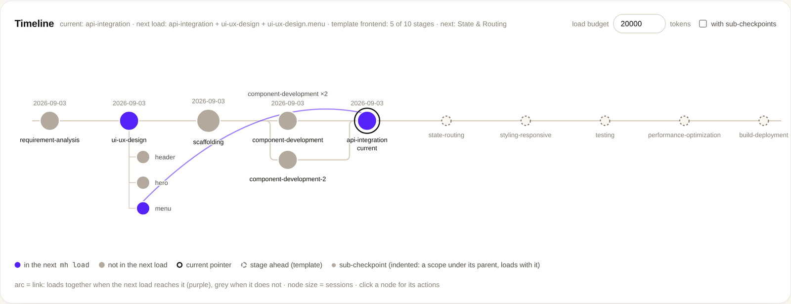
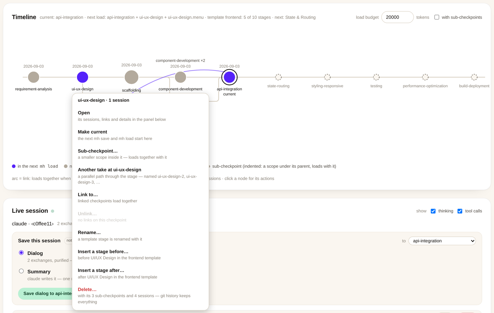
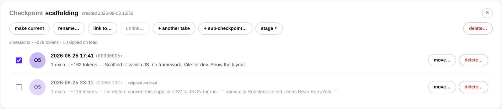
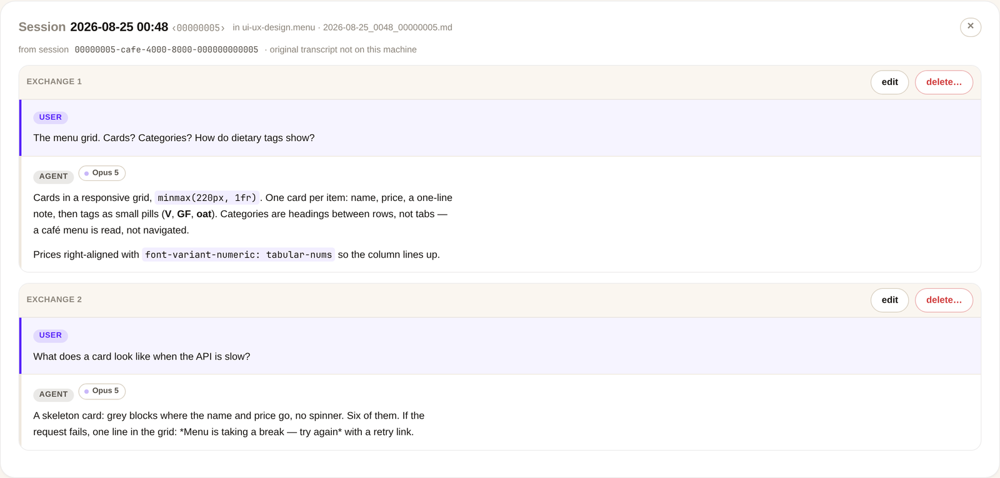
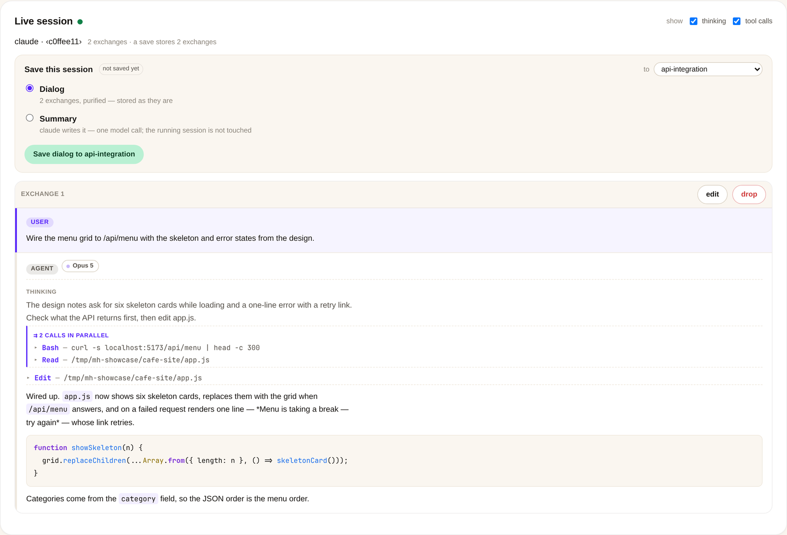
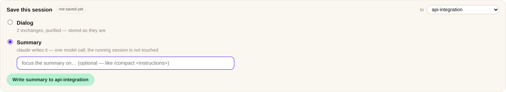
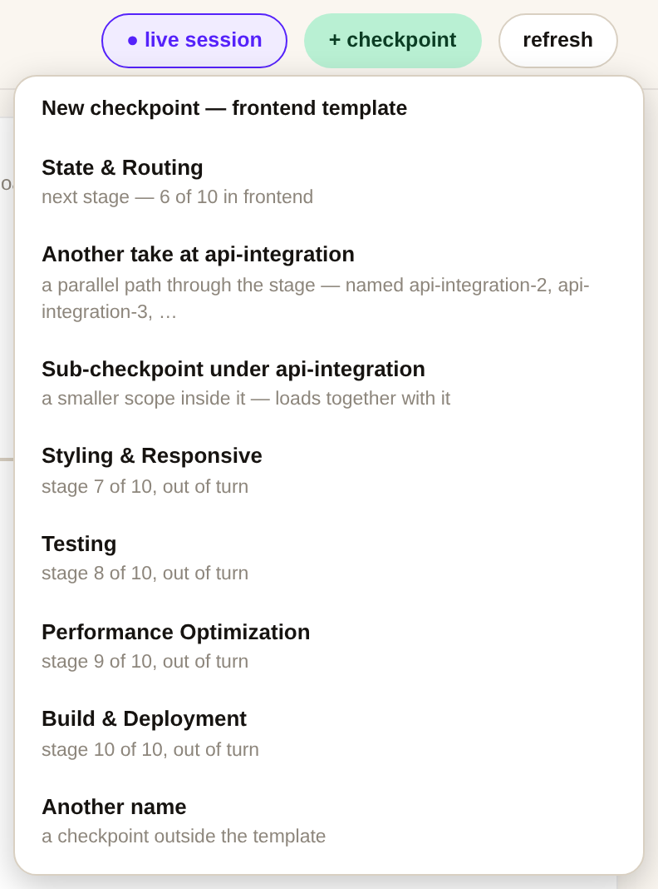

# MemoryHub (`mh`)

[English](README.md) | **简体中文**

[](https://github.com/solknight48/memoryhub/actions/workflows/ci.yml)

给 AI 会话上下文做的、像 git 一样的检查点。一场会话结束，`mh save` 把它提纯后存起来——只留对话，
没有工具噪音，不调用模型。下一场会话 `mh load`，项目记忆就回来了。`mh ui` 是这一切的地图。



## 安装

```sh
uv tool install git+https://github.com/solknight48/memoryhub
mh skill install           # 让 Claude Code 学会 /mh 工作流
```

Linux 或 macOS，git ≥ 2.32，Python ≥ 3.12。

## 快速上手

```sh
cd my-site
mh init --template frontend   # 在项目里建中枢，阶段名字已备好
mh checkpoint                 # 第一个阶段：requirement-analysis
# …… 和 Claude Code 一起干活；结束时 agent 会运行：
mh save                       # 这场会话提纯后存入检查点
# 下一次：
mh load                       # 记忆回到上下文里
mh ui                         # 打开地图
```

`mh hook install` 让 Claude Code 自己完成 load 和 save。

## 地图

点一个节点，看看能对它做什么。



一个检查点和它的会话。取消勾选某个会话，`mh load` 就不再带上它。



一场提纯后的会话：只有对话，别无其他。可以改写或删除单独一轮。



正在进行的会话，连思考和工具调用一起显示，顶部是保存框：存成对话，或存成 agent 写的摘要。





新建检查点：模板里的下一个阶段、同一阶段的另一次尝试、子检查点，或任意名字。



## 命令

| 命令 | 作用 |
|---|---|
| `mh init [--global] [--claude] [--template T]` | 创建中枢。 |
| `mh checkpoint [name] [--at STAGE] [--under CKPT]` | 新建检查点，并设为当前。不给名字：模板里的下一个阶段；只给 `--at`：同一阶段再来一个（`design-2`）；`--under`：子检查点（`design.head-page`）。 |
| `mh template [name] [--list [-v]] [--clear]` | 阶段模板——后面各检查点的默认名字。 |
| `mh save [CKPT] [--to CKPT] [--file MD] [--session-id ID] [--transcript P]` | 提纯当前会话并存入检查点。 |
| `mh save [CKPT] --compact --file MD` | 存入 agent 撰写的摘要，替代完整对话。 |
| `mh save [CKPT] --compact --with agent [--focus TEXT]` | 让这个会话自己的 CLI（`claude -p` 或 `pi -p`；`--with claude`/`pi` 指定一个）写摘要并存入。 |
| `mh import [--to CKPT] [--agent A]... [--dry-run]` | 回填本项目的历史会话（Claude Code、pi、Codex）。 |
| `mh load [CKPT...] [--no-links] [--tree] [--budget N] [--all] [--json]` | 热启动上下文包：所选检查点 + 链接闭包，按时间合并；`--tree` 把所选检查点下的子检查点也带上。 |
| `mh link A B` / `mh unlink A B` | 让两个检查点一起加载 / 取消。 |
| `mh list` / `mh show CKPT[/SESSION]` / `mh search Q` | 查看中枢内容。 |
| `mh trace CKPT/SESSION` | 找回某个保存会话所提纯自的原始 transcript。 |
| `mh rm CKPT[/SESSION] [-x N] [--force]` | 删除检查点、会话，或单独一轮对话。 |
| `mh mv CKPT/SESSION CKPT` / `mh rename CKPT NAME` | 移动会话 / 重命名检查点。 |
| `mh edit CKPT/SESSION -x N [--user T] [--agent T]` | 改写一轮对话的某一侧。 |
| `mh skip CKPT/SESSION` / `mh unskip CKPT/SESSION` | 让某个会话不进 `mh load`（仍留在检查点里）/ 恢复加载。 |
| `mh back [N]` / `mh forward [N]` / `mh goto CKPT` | 移动当前指针。 |
| `mh status` / `mh log` | 位置与统计 / 中枢的 git 日志。 |
| `mh sync` | 对 `origin` 执行 `pull --rebase` + `push`，冲突自动中止。 |
| `mh hubs [--prune]` | 列出所有已注册的中枢。 |
| `mh ui [--port N] [--budget N\|none] [--read-only] [--detach] [--stop] [--session ID]` | 在浏览器里打开检查点地图并整理中枢。 |
| `mh hook install [--user] [--remove] [--budget N] [--tree]` | 通过 Claude Code hooks 自动 load/save。 |
| `mh skill install` | 安装 Claude Code skill。 |

## 全自动

```sh
mh hook install            # 本项目：会话开始时 load，结束时 save
mh hook install --user     # 所有项目
```

SessionStart hook 注入 `mh load`；SessionEnd 和 PreCompact 运行 `mh save`。
`mh hook install --remove` 撤销。

## 值得了解的

- **提纯**只留 User/Agent 对话。工具调用、思考、框架包装和末尾没回答的问句都按规则机械地剥掉。
- **检查点彼此独立。** `mh link A B` 让两个一起加载，按时间合并。`mh load` 先装最新的会话，
  直到 `--budget`（默认 20 000 token）。
- **再来一次**：`design-2` 是穿过同一阶段的另一条路。**子检查点**：`design.header` 是 design 里的
  一个范围，加载它也会带上 design，`--tree` 则加载整个节点。
- **模板**给一类项目的阶段起好名字（`mh template --list`）。在终端里选；地图画出还没到的阶段。
- **跳过**一个会话（`mh skip`，或它那一行的勾选框），之后每次加载都不带它，文件仍留在检查点里。
- **摘要代替对话**：`mh save --compact --with agent` 让会话自己的 CLI（`claude -p`、`pi -p`）来写——
  一次模型调用，正在运行的会话不受影响。
- **每次改动都是一次提交**，`.memoryhub/` 就是一个普通 git 仓库，可以 push。
  `git -C .memoryhub revert HEAD` 就是撤销。
- **只在本机。** 地图只监听回环地址，每次启动一个 token。除非你 push 中枢，什么都不会离开这台机器。

## 开发

```sh
uv run pytest -q           # 测试套件，密闭、并行
uv run ruff check src tests && uv run ruff format --check src tests
```

[CONTRIBUTING.md](CONTRIBUTING.md) 列出改动必须守住的不变量；[CHANGELOG.md](CHANGELOG.md)
记录何时改了什么。`scripts/showcase.py` 用一个一次性项目重新生成上面的截图。

## 许可证

[MIT](LICENSE)。
